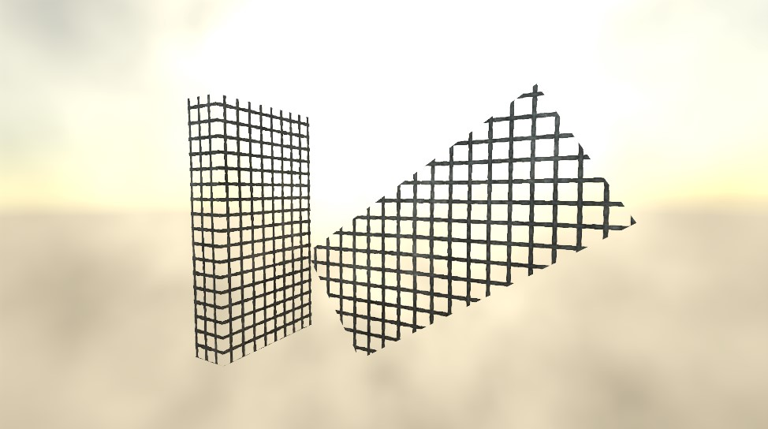
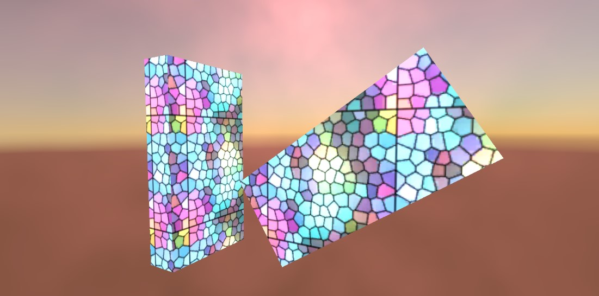

# Ultimate-Triplanar-Shaders for Unity

**Triplanar Shaders for Unity.**

-> TriplanarLit (Simple)

-> TriplanarLit (Advanced)

-> TriplanarUnlit

### Download
[Download here :)](https://github.com/LongEcho/Unity_Ultimate-Triplanar-Shaders/releases)

### Features (Mostly advanced TriplanarLit shader):

- Diffuse (Albendo)
- Normal Map
- Normal Stregth
- Blend (for Triplanar)
- Tiling
- Smoothness
- Smoothness Map
- Metallic
- Metallic Map
- Ambient Occlusion (AO)
- AO Map
- Color
- Contrast
- Saturation
- Opacity
- Alpha Map
- Emissive Color
- Emission Strength
- Emission Map

### Samples:

### Requests / Bugs / Help?
Feel free to open a issue!
